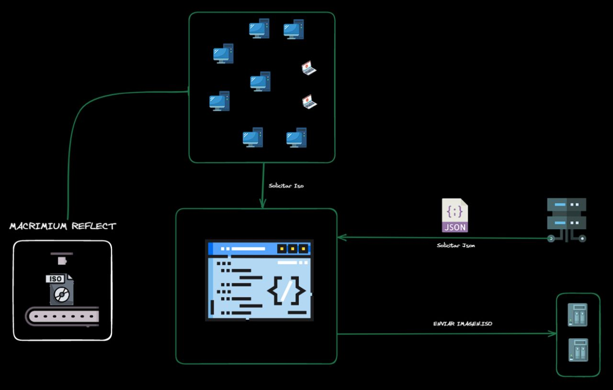

# Backup con Reflect y Powershell

_Este script tiene la funcionalidad de transferir una imagen.iso de una Pc a un servidor ( Nas ). Ademas este genera un reporte del proceso, en archivo Json, que luego sera adjuntado en un mensaje de Correo._



## Comenzando 🚀

### Pre-requisitos 📋

_Instalar en windows PowerShell 7_

_Descargar Reflect._

### Instalación 🔧

- Desactivar windows Defenders
  - presionar las teclas de windows + r
  - Escribir "explorer.exe windowsdefender:" y luego presionar el boton aceptar
- Descargar Moduls
  
  _Instalar Moduls MimeKit_
    ```
    Install-Package -Name 'MimeKit' -Source "https://www.nuget.org/api/v2" -SkipDependencies
    ```
  _Instalar Moduls MailKit_
    ```
    Install-Package -Name 'MailKit' -Source "https://www.nuget.org/api/v2"
    ```
  
  - Descargar el archivo "ProduccionFin.ps1"
- Descargar proyecto completo
  - abrir gitBash
    _inicializar proyecto git_

    ```
    git init
    git config user.name "Usuario"
    git config user.email jfulguera@creminox.com
    ```
    _Clonar repo Git_
    ```
    git clone "https://github.com/JhonatanCremona/BackupScrip.git"
    ```
- Configuracion en el Programador de tareas

  _Ejecutar la aplicacion con powershell 7_
    ```
    pwsh.exe
    ```
  _Agregar argumentos (obligatorio)_
    ```
    -NoProfile -NonInteractive -ExecutionPolicy Unrestricted -Command "& ruta al script a ejecutar"
    ```
- Updates
  - version 1.2v

